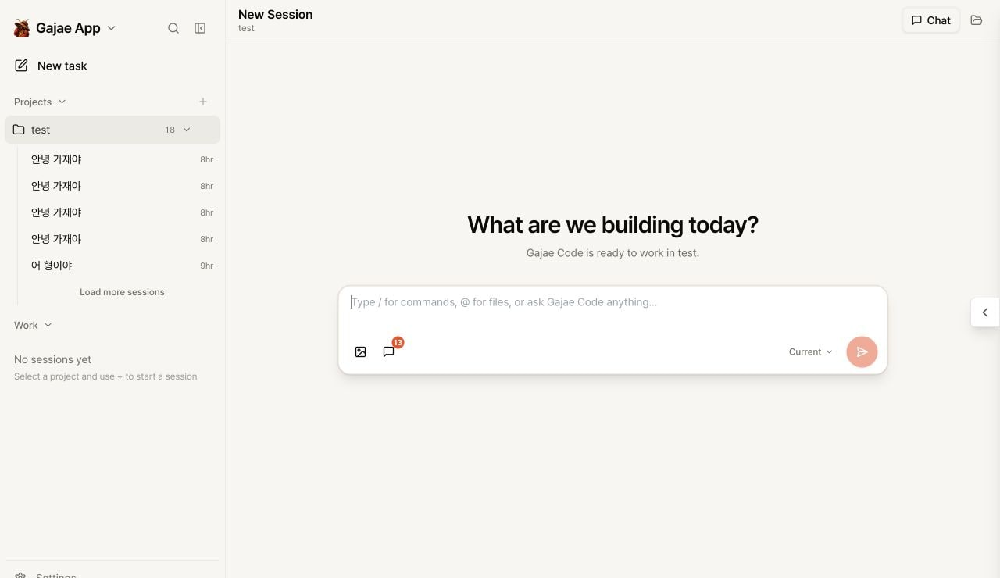
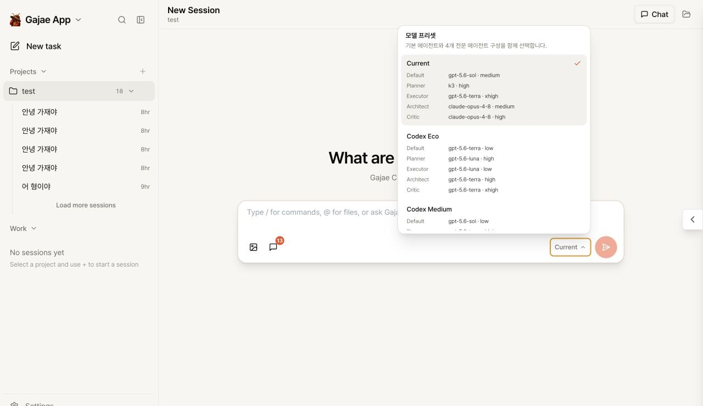
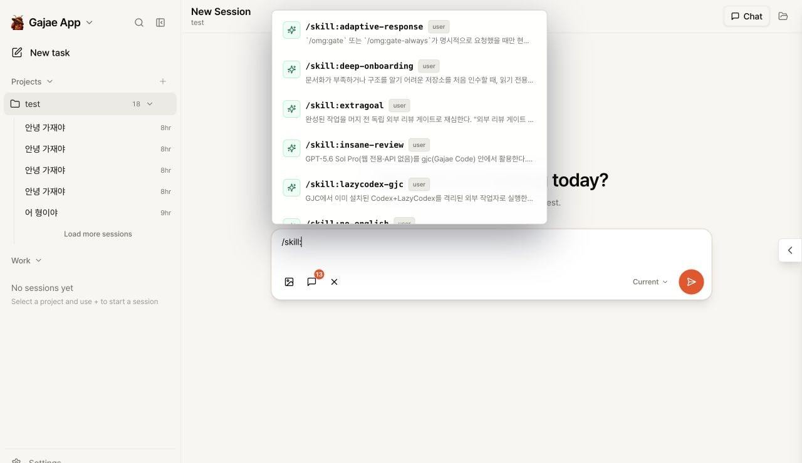

<p align="center">
  <a href="README.md">한국어</a> ·
  <strong>English</strong> ·
  <a href="README.ja.md">日本語</a> ·
  <a href="README.zh-CN.md">简体中文</a> ·
  <a href="README.zh-TW.md">繁體中文</a> ·
  <a href="README.fr.md">Français</a> ·
  <a href="README.de.md">Deutsch</a> ·
  <a href="README.it.md">Italiano</a> ·
  <a href="README.ru.md">Русский</a> ·
  <a href="README.tr.md">Türkçe</a>
</p>

<div align="center">
  
  <h1>Gajae App</h1>
  <p><strong>A local-first AI coding desktop for Gajae Code</strong></p>
  <p>Manage projects, sessions, agent presets, and skills in one workspace.</p>
</div>

<p align="center">
  <a href="https://github.com/devswha/Gajae-code-app/actions/workflows/ci.yml"></a>
  <a href="https://github.com/devswha/Gajae-code-app/releases"></a>
  <a href="LICENSE"></a>
  
  
</p>

<p align="center">
  <a href="https://github.com/devswha/Gajae-code-app/releases/tag/v2.0.0-beta.2"><strong>Download for macOS</strong></a> ·
  <a href="#key-features">Features</a> ·
  <a href="#run-from-source">Development</a> ·
  <a href="https://github.com/devswha/Gajae-code-app/issues">Issues</a>
</p>

<p align="center"></p>
<p align="center"><sub>Expand a project to reach its sessions, then start a new GJC task in the same workspace.</sub></p>

## What is Gajae App?

Gajae App is an open-source desktop and browser workspace for [Gajae Code](https://github.com/devswha/gajae-code). It starts and resumes GJC sessions and organizes streaming responses and tool activity by project.

The app does not include an AI model or subscription. It uses the accounts, models, and agent configuration already set up in Gajae Code. Project files and execution state remain on the machine running the app.

> This repository is the **GJC-only v2 beta product line**. The previous tmux control surface and multi-provider UI are preserved in [gaminus](https://github.com/devswha/gaminus).

## Key features

- **Project-first sessions** — Expand a project and its sessions appear directly below it, without moving to a separate Work list.
- **Fast task creation** — Start a GJC session from **New task** or the `+` on a project row.
- **Agent presets** — Switch the models and reasoning effort for Default, Planner, Executor, Architect, and Critic as one configuration.
- **Skills in chat** — Search project, user, and bundled skills with `/skill:<name>`.
- **Live execution timeline** — Follow streaming output, thinking state, tool calls, approvals, aborts, and resumes in one conversation.
- **Archive and restore** — Archive projects and sessions without deleting them, then restore them when needed.
- **Local file browsing** — Open files from the current project without leaving the task context.
- **One core for desktop and web** — The Tauri shell and browser UI share the same local server and GJC execution boundary.

## Product views

<table>
  <tr>
    <td width="50%" align="center"><br><sub><b>Agent presets</b><br>Configure the default agent and four specialist roles together</sub></td>
    <td width="50%" align="center"><br><sub><b>Skill commands</b><br>Search project, user, and bundled skills from chat</sub></td>
  </tr>
</table>

## Install the macOS app

The public desktop beta currently supports **Apple Silicon (M1 or newer) on macOS 11 or newer**.

1. Download the DMG and matching `.sha256` file from the [v2.0.0-beta.2 release](https://github.com/devswha/Gajae-code-app/releases/tag/v2.0.0-beta.2).
2. Verify the download:

   ```bash
   cd ~/Downloads
   shasum -a 256 -c gajae-app-desktop-2.0.0-beta.2-macos-arm64.dmg.sha256
   ```

3. Open the DMG and drag **Gajae App** into **Applications**.
4. On first launch, Control-click the app in Finder and choose **Open**. If macOS blocks it, use **System Settings → Privacy & Security → Open Anyway**.

> The current beta DMG is ad-hoc signed and not yet Apple-notarized. Only use an artifact from GitHub Releases whose checksum matches.

### Distribution support

| Target | Status | Requirements |
|---|---|---|
| macOS arm64 desktop | Beta DMG available | macOS 11+, Apple Silicon |
| Linux x86_64 server | Beta server artifact available | glibc 2.35+, Node.js 22 |
| Browser development | Runs from source | Node.js 22 or 24 |
| Intel Mac / Windows / Linux desktop | Not supported yet | Packaging and validation required |

Versioned artifacts and their `.sha256` files are published through [GitHub Releases](https://github.com/devswha/Gajae-code-app/releases).

## Basic workflow

1. Select the `+` beside **Projects** to add a local workspace.
2. Expand the project to open a previous session, or select the row `+` to create one.
3. Choose an agent configuration from the preset picker in the composer.
4. Send a prompt and follow responses, tool activity, and approvals in real time.
5. Type `/` for built-in commands or `/skill:` to find available skills.
6. Open the file panel when you need to inspect project files in context.

## Presets and skills

The picker combines the **Current configuration**, **28 built-in presets** for GJC `0.11.1`, and user-defined presets. Presets cover five roles: Default, Planner, Executor, Architect, and Critic.

- Custom presets: `~/.gjc/agent/models.yml`
- Current role configuration: `~/.gjc/agent/config.yml`

`/skill:` merges skills in this precedence order:

1. Project: `<workspace>/.gjc/skills/<name>/SKILL.md`
2. User: `~/.gjc/agent/skills/<name>/SKILL.md`
3. Bundled Gajae App skills

A visible skill needs valid `name` and `description` fields. Skills with `enabled: false` or `hide: true` are hidden.

## Run from source

Requirements: Node.js `22.22.2+` or `24.15.0+`, npm, Git, and a configured Gajae Code account/model. Desktop builds also require rustup-based Rust `1.85.1`.

```bash
git clone https://github.com/devswha/Gajae-code-app.git
cd Gajae-code-app
npm ci
npm run dev
```

Open <http://127.0.0.1:5173>. The development API runs on `127.0.0.1:3001`.

For Tauri desktop development:

```bash
npm ci
npm run desktop:dev
```

## Architecture

```text
React UI (Browser / Tauri)
          │ HTTP + WebSocket
          ▼
Gajae App local server
          │
          ├── SQLite · project files · Git/worktree
          ▼
gajae-core (Rust process host)
          │ private stdio protocol
          ▼
GJC worker ──▶ Gajae Code CLI / SDK
```

The Rust core owns process lifecycle, file watching, job state, and PTY boundaries. The server owns task and session state so a temporary UI disconnect can recover. The desktop shell only connects to a loopback server and protects bootstrap with a nonce and `HttpOnly` cookie.

See the [architecture roadmap](docs/GJC-DESKTOP-ARCHITECTURE-ROADMAP.md) and [Tauri verification record](docs/DESKTOP-TAURI-VERIFICATION.md) for details.

## Development commands

| Command | Purpose |
|---|---|
| `npm run dev` | Run the React client and development server |
| `npm run desktop:dev` | Run the Tauri desktop app |
| `npm test` | Run server and client tests |
| `npm run typecheck` | Check TypeScript |
| `npm run lint` | Run ESLint |
| `npm run build` | Build the client, server, and Rust core |
| `npm run verify` | Run the complete quality gate |

For server deployment, see the [installation guide](docs/INSTALL.md) and [self-hosting guide](docs/SELF-HOST.md).

## Project status and license

Gajae App v2 is in beta. Back up `~/.gajae-app/data` and your GJC configuration before upgrading. Report problems with the OS, app version, and reproduction steps in [Issues](https://github.com/devswha/Gajae-code-app/issues/new).

Gajae App is distributed under [GNU AGPL v3.0 or later](LICENSE). It began from the Siteboon AI B.V. upstream UI codebase and has been rebuilt as a GJC-specific product. See [NOTICE](NOTICE) and the [upstream policy](docs/UPSTREAM.md) for attribution and intake rules.
