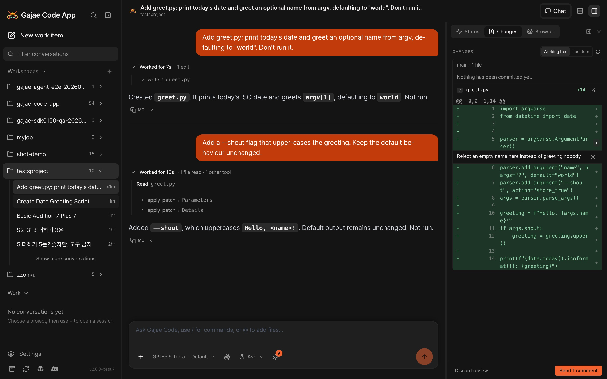

<p align="center">
  
</p>

<h1 align="center">Gajae Code App</h1>

<p align="center">
  <strong>Run the agent. Watch the work. Keep everything on your machine.</strong>
</p>

<p align="center">
  <a href="https://github.com/devswha/gajae-code-app/actions/workflows/ci.yml"></a>
  <a href="LICENSE"></a>
  <a href="https://github.com/devswha/gajae-code-app/releases/latest"></a>
  <a href="#quick-start"></a>
  <a href="https://github.com/devswha/gajae-code"></a>
</p>

<p align="center">
  <a href="https://github.com/devswha/gajae-code-app/releases/latest"><b>Download for Mac — signed and notarized</b></a> ·
  <a href="https://devswha.github.io/gajae-code-app/"><b>Website</b></a>
</p>

<p align="center">
  
</p>

<p align="center"><em>Two turns in one session: each turn's tool calls folded into a work block, the Changes tab showing the working tree as a diff, and a line comment waiting to become the next message.</em></p>


Gajae Code App is a self-hosted web and desktop interface for [Gajae Code](https://github.com/devswha/gajae-code). It drives the agent through the runtime's own SDK in an isolated worker, shows every turn as it happens, and puts a review loop between the agent's edits and your next message — on a machine you control, with credentials that never leave it.

- **The same agent as the terminal**: the app uses the runtime's own account selection (`gjc accounts pin`, usage-limit rotation), the user's models, presets, skills and user-scope MCP servers, and slash commands such as `/fast`, `/effort`, `/context` and `/compact`. Reasoning streams live while the model thinks.
- **Sessions with a state** — running, waiting for your answer, finished unread, or failed; a Work section lists what needs a look across every project, and the model titles each session from its first message.
- **The work, folded** — a turn's tool calls collapse into one block with a live status row; three output densities; Stop or Esc ends a turn, a message sent mid-turn steers it.
- **Permissions that ask** — commands and destructive edits wait for approval by default; each project picks Ask, Auto-approve edits or Bypass, plus an always-allow list.
- **Isolated by default**: a new repository session runs in its own managed git worktree. The run-location picker can put it on the shared checkout instead, and a run that would rewrite git state outside its own checkout asks first.
- **A Changes tab, not a git GUI** — the working tree as a diff, a Last-turn scope for what the session just edited, and line comments that become the next message. Git stays the agent's job.
- **Browser choices**: macOS desktop sessions can use the built-in system-WebView browser. Aside and ego lite are experimental backends, and web/self-host sessions use external links. Computer use is off until you turn it on in Settings.
- **Every viewer** — a second tab or a phone on the LAN sees the same live run; the layout goes down to a phone screen.

## Quick Start

**macOS (Apple Silicon, macOS 13+) — the desktop app.** Download the DMG from [Releases](https://github.com/devswha/gajae-code-app/releases/latest), verify it, drag it to Applications, open it. The image is signed with a Developer ID and notarized by Apple, so Gatekeeper opens it like any other app. After that the app checks for updates itself; downloading and restarting happen only when you click ([how updates work](docs/DESKTOP-CLICK-UPDATE.md)).

```bash
cd ~/Downloads
shasum -a 256 -c gajae-app-desktop-2.0.0-beta.20-macos-arm64.dmg.sha256
```

**Linux server (x86_64, glibc 2.35+, Node.js 22) — self-host the web UI.** Unpack the server archive, run it as a per-user systemd service, reach it through a browser over an SSH tunnel or VPN.

```bash
sha256sum --check gajae-app-server-2.0.0-beta.20-linux-x64-node22.tar.gz.sha256
```

Install, upgrade and rollback steps: [docs/INSTALL.md](docs/INSTALL.md) · [docs/SELF-HOST.md](docs/SELF-HOST.md).

**From source — Node.js 22.x (22.22.2+), Rust, Bun 1.4.0.**

```bash
git clone https://github.com/devswha/gajae-code-app.git
cd gajae-code-app
npm ci
node scripts/fetch-bun.mjs          # the pinned Bun the GJC worker runs on
npm run dev                         # server :3001, client :5173
npm run desktop:dev                 # the same, inside the Tauri desktop shell
```

The app uses the models, presets, skills and credentials of the Gajae Code installation in `~/.gjc`, and you can sign in to providers from inside the app. The desktop app is macOS-first. There are no Intel Mac, Windows or Linux desktop downloads; the Linux desktop packaging is kept but not maintained ([Linux desktop guide](docs/DESKTOP-LINUX.md)).

## Permission Modes

The runtime's own gate defaults to *allow*; the app does not. Every project has a persisted mode, set from the composer or Settings → Permissions, and an always-allow list that the permission card's **Always allow** fills.

| Mode | Runs without asking | Waits for approval |
|---|---|---|
| **Ask** (default) | Reads, searches, and file writes and edits the runtime does not gate | Commands (`bash`, `eval`), file deletes and moves — everything the runtime gates |
| **Auto-approve edits** | The above, plus every file mutation (`edit`, `write`, `delete`, `move`) | Commands |
| **Bypass** | Everything | Nothing — for a scratch project you trust the agent with |

A card answered in one tab closes in every other viewer. Always deny is offered when the runtime offers it and holds for the run.

## Facts

|  |  |
|---|---|
| **Runtime** | Gajae Code SDK 0.17.6 on Bun 1.4.0, bundled, driven in an isolated worker; prompts pass through an owner-readable temp file, never a process argument |
| **Where things live** | Database, assets and cache under `~/.gajae-app`; transcripts stay in the runtime's own session files and are never copied into the app's database |
| **Network** | Loopback by default and fail-closed (it can run shell commands); cross-origin callers are rejected on HTTP and WebSocket |
| **Trust boundary** | One owner: whoever reaches the server is the owner, so the network is the boundary — loopback, a tailnet, or a proxy that authenticates in front. Managed worktrees run git without the system or user gitconfig; a checkout filter in a repository's own `.git/config` (git-lfs is one) still runs, the same trust `git status` places in a checkout you opened |
| **Stack** | React 19 · Vite 7 · Tailwind 4 · Express · SQLite · a Rust core · Tauri 2 for the desktop shell |
| **Gate** | `npm run verify`: audit, typecheck, Rust core, tests, GJC e2e, lint, identity check, build |
| **License** | MIT since v2.0.0-beta.7 (earlier betas AGPL-3.0) |

## Documentation

- [Self-hosting](docs/SELF-HOST.md) · [Install the server release](docs/INSTALL.md)
- [Release notes](https://github.com/devswha/gajae-code-app/releases) · [Latest release record](docs/RELEASE-BETA20.md) · [Changelog through beta.7](CHANGELOG.md)
- [Desktop packaging, signing and notarization](docs/DESKTOP-TAURI-VERIFICATION.md)
- [Built-in browser contract](docs/BUILTIN-BROWSER.md)
- [GJC provider and worker contract](server/GJC-LIVE-SPEC.md) · [Worker protocol](docs/GJC-WORKER-PROTOCOL.md)
- [Design system](DESIGN.md) · [Repository guide for agents](AGENTS.md)
- [Licensing](docs/LICENSING.md) · [Relicensing record](docs/RELICENSING.md) · [Upstream intake](docs/UPSTREAM.md)
- [Contributing](CONTRIBUTING.md) · [Contributor terms](CLA.md)

## License

MIT. See [LICENSE](LICENSE) and [THIRD-PARTY-NOTICES.md](THIRD-PARTY-NOTICES.md). The project began as a fork and was rewritten file by file before relicensing; [docs/UPSTREAM.md](docs/UPSTREAM.md) names the origin and [docs/RELICENSING.md](docs/RELICENSING.md) records the method and the measured residual.
