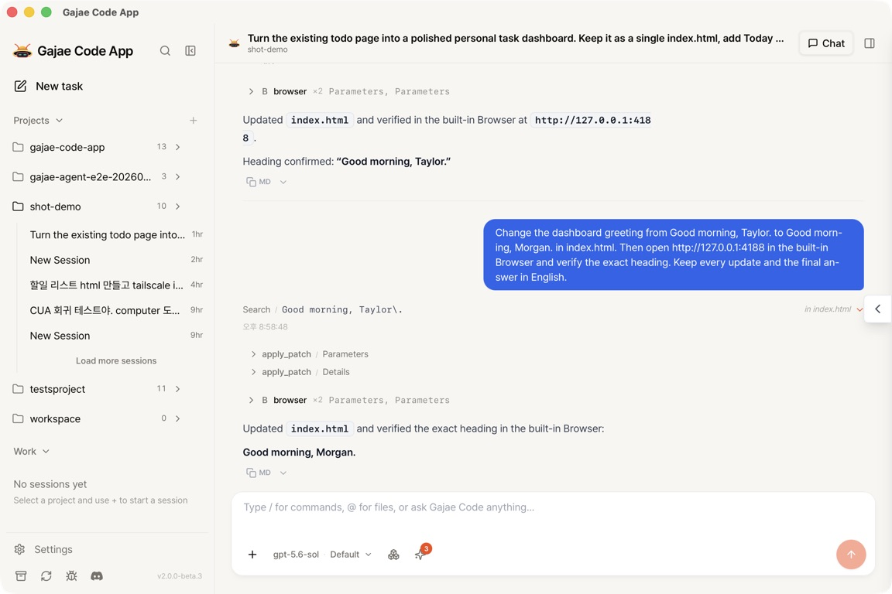

# Gajae Code App

A self-hosted web and desktop interface for [Gajae Code](https://github.com/devswha/gajae-code).
Run the agent from a browser tab or a native window, follow what it does turn by
turn, review the changes it makes, and keep every project and credential on your
own machine.

[Download](https://github.com/devswha/gajae-code-app/releases) ·
[Website](https://devswha.github.io/gajae-code-app/) ·
[Changelog](CHANGELOG.md) ·
[Self-hosting](docs/SELF-HOST.md) ·
[Contributing](CONTRIBUTING.md)



## What you get

- **Sessions, not transcripts.** Each project keeps its conversations; the
  sidebar shows which ones are running, waiting for your answer, finished but
  unread, or failed, and a Work section lists everything that needs a look
  across projects. New sessions are titled by the model from the first message.
- **The work, folded.** A turn's tool calls collapse into one block with a live
  status row; pick compact, balanced or detailed tool output. Stop or Esc ends
  a turn; a message sent mid-turn steers it.
- **Permissions that ask.** Commands and destructive file changes wait for
  approval by default. Each project can be set to Ask, Auto-approve edits or
  Bypass, with an always-allow list, from the composer or Settings.
- **Changes tab.** The project's working tree as a diff, a Last-turn scope for
  what the session just edited, and line comments that collect into one review
  message for the next turn. No staging or revert buttons: git stays the
  agent's job, and files open in your own editor.
- **Shared browser.** The agent verifies in a built-in Chromium tab; you can
  expand the same live page and continue from there.
- **Model and reasoning per session.** Choose the model and reasoning depth
  for the next turn without leaving the session. Context usage is shown as
  you go.
- **More than one viewer.** A second tab, or a phone on the LAN, sees the same
  live run. The layout adapts down to a phone-sized screen.

The app bundles the GJC runtime (SDK 0.15.6 on Bun 1.4.0) and drives it in an
isolated worker. It uses the models, presets, skills and credentials of the
Gajae Code installation in `~/.gjc`; you can also sign in to providers from
inside the app.

## Get it

Everything is published on
[GitHub Releases](https://github.com/devswha/gajae-code-app/releases) with a
`.sha256` beside each artifact.

**macOS (Apple Silicon, macOS 11+)** — `gajae-app-desktop-<version>-macos-arm64.dmg`.
Since v2.0.0-beta.7 the image is signed with a Developer ID and notarized by
Apple, so it opens like any other app. Verify it first:

```sh
cd ~/Downloads
shasum -a 256 -c gajae-app-desktop-<version>-macos-arm64.dmg.sha256
```

**Linux server (x86_64, glibc 2.35+, Node.js 22)** —
`gajae-app-server-<version>-linux-x64-node22.tar.gz`, run as a per-user
systemd service and reached through a browser. Install and upgrade steps:
[docs/INSTALL.md](docs/INSTALL.md), [docs/SELF-HOST.md](docs/SELF-HOST.md).

Intel Mac, Windows and Linux desktop builds are not available yet.

## Run from source

Requirements: Node.js 22.22.2+ (or 24.15.0+), Rust/cargo, and Bun **exactly**
1.4.0 for the GJC worker (`node scripts/fetch-bun.mjs` fetches the pinned
build into `dist-native/`).

```sh
git clone https://github.com/devswha/gajae-code-app.git
cd gajae-code-app
npm ci
node scripts/fetch-bun.mjs
npm run dev          # server on http://localhost:3001, Vite client on http://localhost:5173
```

`npm run desktop:dev` opens the Tauri desktop shell around the same server.
`npm run verify` is the promotion gate (audit, typecheck, Rust core, tests,
lint, identity check, build); `npm test` runs the test suites alone. See
[AGENTS.md](AGENTS.md) for the repository map and conventions.

## Security posture

- The server binds to loopback by default and fails closed if asked to do
  otherwise. It can run shell commands; reach it remotely through an SSH tunnel
  or a VPN, not a public port.
- Cross-origin callers are rejected on both HTTP and WebSocket.
- Project files, execution state and the SQLite database live under
  `~/.gajae-app` on the host that runs the server. Transcripts stay in the
  runtime's own session files; the app never copies them into its database.
- Prompts reach the worker through an owner-readable temp file, never on a
  process command line.

## Docs

| Topic | Where |
|---|---|
| Install and upgrade the server release | [docs/INSTALL.md](docs/INSTALL.md), [docs/SELF-HOST.md](docs/SELF-HOST.md) |
| Desktop packaging, signing and notarization | [docs/DESKTOP-TAURI-VERIFICATION.md](docs/DESKTOP-TAURI-VERIFICATION.md) |
| GJC provider and worker contract | [server/GJC-LIVE-SPEC.md](server/GJC-LIVE-SPEC.md), [docs/GJC-WORKER-PROTOCOL.md](docs/GJC-WORKER-PROTOCOL.md) |
| Design system | [DESIGN.md](DESIGN.md) |
| Licensing and provenance | [docs/LICENSING.md](docs/LICENSING.md), [docs/RELICENSING.md](docs/RELICENSING.md), [docs/UPSTREAM.md](docs/UPSTREAM.md) |

## Contributing

Issues and pull requests are welcome; read [CONTRIBUTING.md](CONTRIBUTING.md)
first. Contributions are accepted under the terms in [CLA.md](CLA.md).

## License

[MIT](LICENSE) since v2.0.0-beta.7. Earlier releases were AGPL-3.0. Notices
for bundled dependencies are in [THIRD-PARTY-NOTICES.md](THIRD-PARTY-NOTICES.md).
